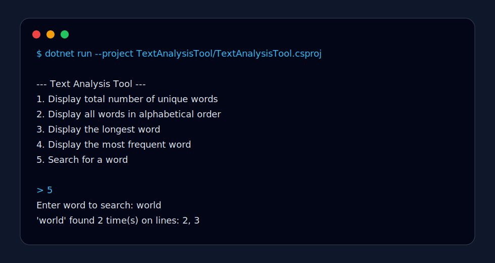

# BST Text Indexer

C# text-indexing application built around a binary search tree. The app parses a text file, indexes unique words, tracks line occurrences, and exposes search and summary operations through a console interface.

## Features



- Count unique words.
- Display terms in alphabetical order.
- Find the longest indexed word.
- Find the most frequent word.
- Search for a word and return frequency plus source line numbers.
- Run against a bundled sample or any supplied text file.

## Data Structure

Each unique word is stored as a tree node containing:

- the word text,
- occurrence frequency,
- line numbers where the word appears,
- left and right child references.

In-order traversal produces sorted output without a separate sort pass.

## Repository Structure

```text
.
├── TextAnalysisTool.sln
├── TextAnalysisTool/
│   ├── Program.cs
│   ├── TextAnalysisTool.csproj
│   ├── TreeNode.cs
│   ├── WordBinaryTree.cs
│   └── WordInfo.cs
├── samples/
│   └── sample_text.txt
├── docs/
│   └── technical_brief.md
└── README.md
```

## Run

Install .NET 8, then run the bundled sample:

```bash
dotnet run --project TextAnalysisTool/TextAnalysisTool.csproj
```

Or pass a custom text file:

```bash
dotnet run --project TextAnalysisTool/TextAnalysisTool.csproj -- path/to/file.txt
```

## Engineering Direction

The binary search tree is intentionally implemented directly rather than delegated to library collections. That keeps insertion, lookup, traversal, and recursive aggregation visible. A useful comparison exercise is to benchmark this implementation against `Dictionary<string, WordInfo>` and a self-balancing tree.
